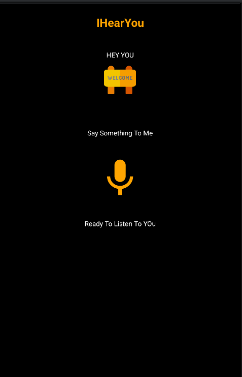

## Overview

- This is a minimalistic user interface for a simple application called "IHearYou". The interface consists of a heading entitled "HEY YOU"; accompanied by a orange icon displaying "WELCOME" on its screen, creating a friendly and inviting atmosphere. Then there is a a text that reads "Say Something To Me," hinting to the user to interact with the application & a microphone icon rendered in the same orange color scheme, followed by text stating "Ready To Listen To You." indicating the application is prepared to receive voice input from the user.
- The aim was to create a minalistic design with a vibrant (orange) touch creating a simplicity and ease of use application.
